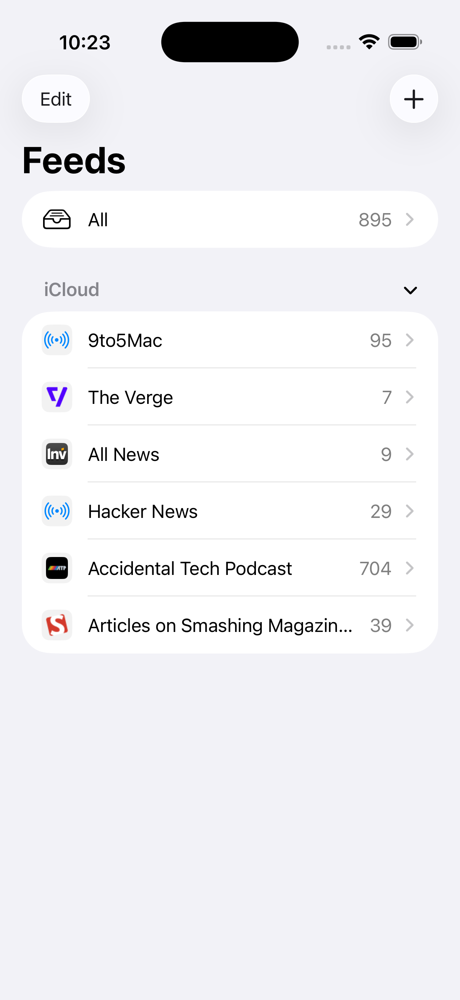
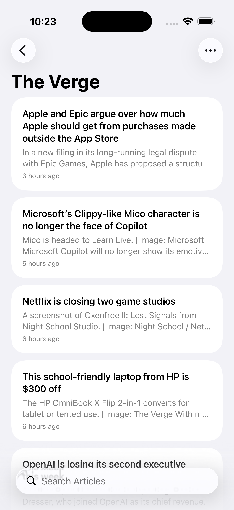
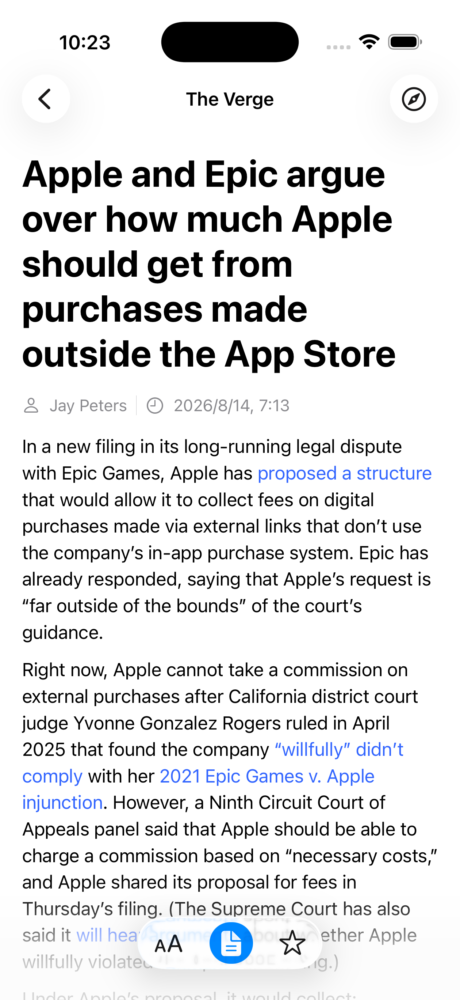
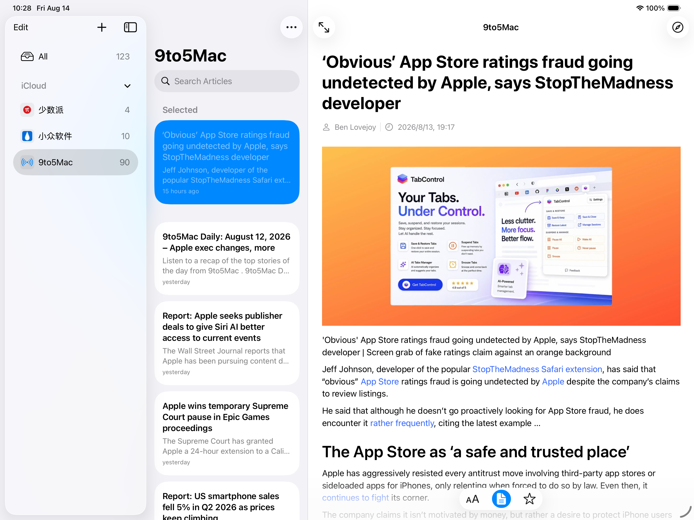
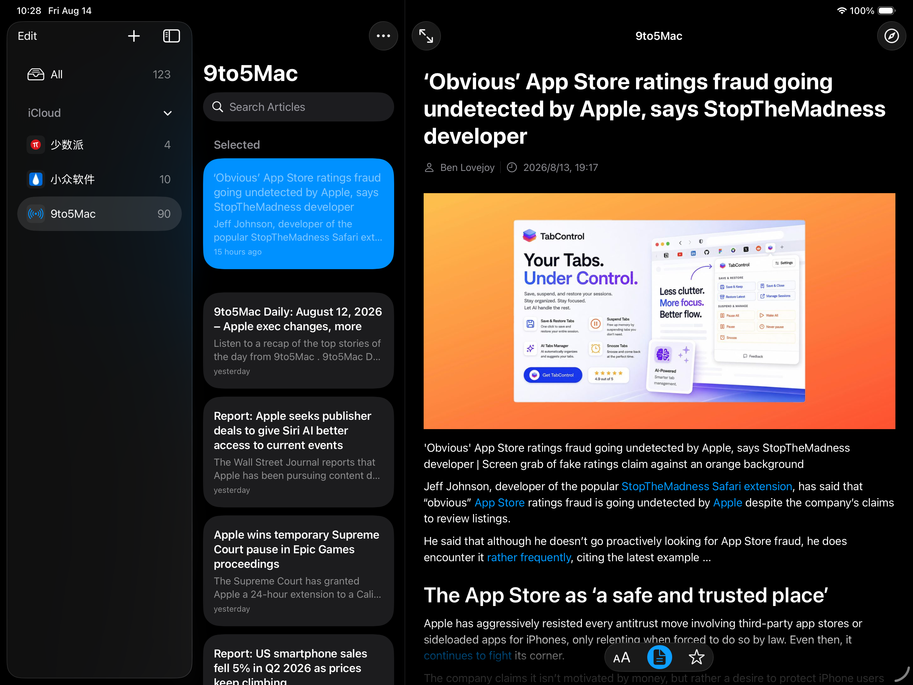

# feeds

A cross-platform RSS reader built with SwiftUI, SwiftData, and CloudKit. Designed for macOS and iOS, it keeps your subscriptions and reading progress in sync across your devices through iCloud.

## Features

- **Subscriptions** — Add, edit, and organize RSS/Atom feeds.
- **Three-column navigation** — Sidebar, article list, and reader layout (adaptive on iPhone).
- **Article reader** — Rendered Markdown with adjustable reading appearance (font size, theme).
- **Full-text extraction** — Optionally extract the full article content from the original page.
- **Audio playback** — Listen to articles with the built-in audio player.
- **Read / starred state** — Track read articles and star favorites, synced across devices.
- **iCloud sync** — CloudKit-backed SwiftData store with conflict reconciliation.
- **Feed icons** — Automatic fetching and caching of feed icons.
- **Refresh & counts** — Background feed refresh with per-subscription unread counts.

## Screenshots

<p align="center">
  
  
  
</p>

<p align="center">
  
  
</p>

## Requirements

- macOS 14.0+ / iOS 17.0+
- Xcode 15.0+
- Swift 6
- An Apple Developer account (for CloudKit / iCloud capabilities)

## Project Structure

```
feeds/
├── feeds.xcodeproj
├── feeds/
│   ├── App/                  # App entry point, persistence, preferences, scene state
│   ├── Models/               # SwiftData models (Feed, Article) and store setup
│   ├── Feeds/                # Feed parsing, sync, icons, persistence queries
│   ├── Articles/             # Article content extraction, Markdown rendering, audio
│   ├── Cloud/                # CloudKit schema init and data reconciliation
│   ├── Views/                # SwiftUI views (subscriptions, articles, reader, etc.)
│   ├── Preview/              # Preview sample data
│   ├── Assets.xcassets/      # App icon and accent color
│   ├── Info.plist
│   ├── feeds.entitlements         # iOS entitlements
│   └── feeds-macOS.entitlements   # macOS entitlements
├── feedsTests/               # Unit tests
├── feedsUITests/             # UI tests
└── script/                   # Build & run helper scripts
```

## Getting Started

### Open in Xcode

1. Clone the repository:
   ```bash
   git clone <repo-url>
   cd feeds
   ```
2. Open `feeds.xcodeproj` in Xcode.
3. Select your development team under **Signing & Capabilities** for both the macOS and iOS targets (required for CloudKit).
4. Choose a target (My Mac or a simulator/device) and run (`⌘R`).

### Build & Run from the Command Line

A helper script is provided for macOS development builds:

```bash
./script/build_and_run.sh            # Build and launch (default)
./script/build_and_run.sh --build    # Build only
./script/build_and_run.sh --verify   # Build, launch, and verify it stays running
./script/build_and_run.sh --debug    # Build and attach lldb
./script/build_and_run.sh --logs     # Stream app logs via `log stream`
```

The script uses isolated derived data and source package directories by default
(`/private/tmp/feeds-macos-derived-data` and
`/private/tmp/feeds-source-packages`), overridable via the
`FEEDS_DERIVED_DATA_DIR` and `FEEDS_SOURCE_PACKAGES_DIR` environment variables.

## CloudKit Setup

The app uses the iCloud container `iCloud.dev.qiyang.feeds` (see
`feeds/Models/FeedsStore.swift`). To use CloudKit in your own environment:

1. Set the iCloud container identifier to match your own in
   `FeedsStore.cloudKitContainerIdentifier` and the entitlements files.
2. Enable the **CloudKit** capability with a **Private** database for both
   targets.
3. (Debug only) Initialize the development schema by launching with the
   `CloudKitSchemaInitializer` launch argument — see
   `feeds/Cloud/CloudKitSchemaInitializer.swift`.

## Testing

- **Unit tests:** `feedsTests/` — covers feed parsing, sync persistence,
  audio content, reading appearance, content scene state, CloudKit reconciler
  lifecycle, and feed query performance.
- **UI tests:** `feedsUITests/` — uses launch arguments
  (`-ui-testing-sample`, `-ui-testing-restoration-sample`,
  `-ui-testing-reset-preferences`, etc.) to seed deterministic sample data.

Run tests from Xcode (`⌘U`) or:

```bash
xcodebuild test -project feeds.xcodeproj -scheme feeds -destination 'platform=macOS'
```

## License

Distributed under the MIT License. See [`LICENSE`](LICENSE) for more information.
